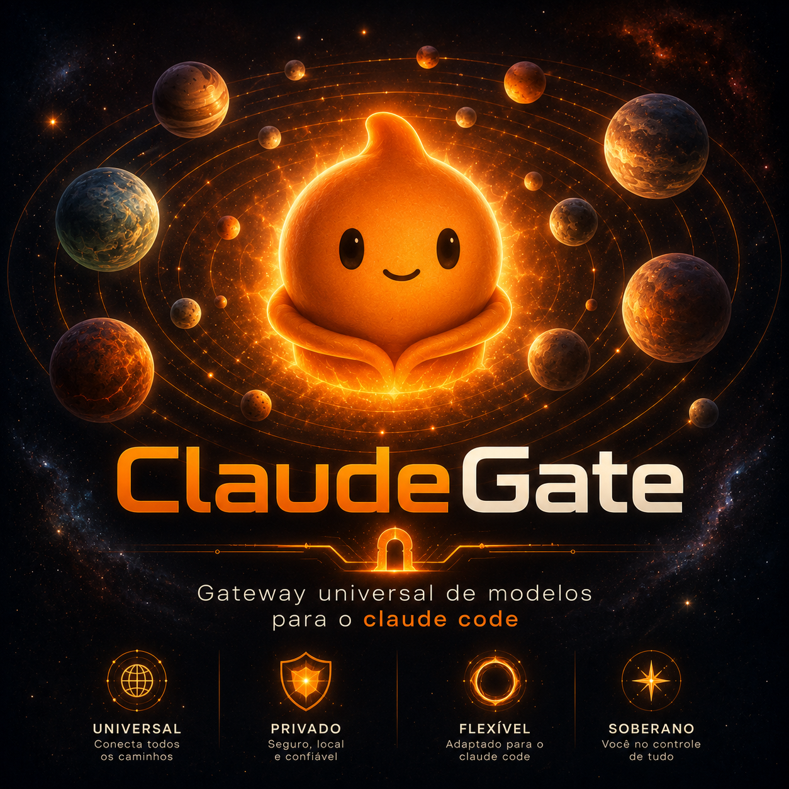

# claudegate

Gateway local multi-porta para Claude Code e uso geral com qualquer API OpenAI-compatible.

Cada porta roda uma instância isolada que fala dois protocolos ao mesmo tempo:
- Anthropic Messages API (/v1/messages) -- para o Claude Code
- OpenAI Chat Completions (/v1/chat/completions, /chat/completions) -- para qualquer outro projeto

Por baixo, cada instância repassa para o provider que você configurar: OpenRouter, DeepSeek, xAI, Gemini, ou qualquer endpoint compatível com OpenAI.

```
claudegate           (porta 4419, master + dashboard principal, em background)
   |
   +-- instancia :4421  (gateway)  +  :4422  (dashboard de config)
   +-- instancia :4423  (gateway)  +  :4424  (dashboard de config)
   +-- instancia :4425  (gateway)  +  :4426  (dashboard de config)
   +-- ... quantas precisar, criadas sob demanda
```

Node.js puro. Sem dependências de runtime além do systray2 (ícone de bandeja). Sem banco de dados. Tudo fica em memória.

---

## Por que portas separadas?

A ideia não é escolher modelo por requisição. É isolar contas e credenciais por sessão de terminal. Você abre `claude-4421` numa aba e está usando aquele provider com aquela chave. Se tiver várias chaves de contas diferentes, pode trocar de sessão sem editar configuração nenhuma.

---

## Instalação

```bash
git clone https://github.com/seu-usuario/claudegate.git
cd claudegate
npm install
sudo npm install -g .
```

Depois disso o comando `claudegate` fica disponível no terminal.

---

## Primeiros passos

### 1. Subir o master

```bash
claudegate
```

O master roda em background, não precisa manter o terminal aberto. O dashboard principal abre automaticamente em http://127.0.0.1:4419.

Para parar: `claudegate stop`.

### 2. Criar uma instância

```bash
claudegate new
```

Ou clique em "nova instância" no dashboard principal.

A instância nasce sem provider configurado. Se tentar usar antes de configurar, retorna erro 503 com uma mensagem explicando o que falta.

### 3. Configurar o provider

Abra o dashboard da instância (a porta par retornada no passo anterior) e preencha:

- **Nome** -- identificação no dashboard, pode ser qualquer coisa
- **Base URL** -- endpoint do provider, sem /chat/completions no final. Exemplo: `https://openrouter.ai/api/v1`
- **API Key** -- sua chave do provider
- **Modelos** -- até 4 modelos que o Claude Code vai enxergar:
  - Modelo principal (obrigatório)
  - Opus (opcional)
  - Sonnet (opcional)
  - Haiku (opcional)

Tem também um botão para buscar os modelos disponíveis no provider. Ele chama GET /models e lista tudo como chips clicáveis, não precisa ficar adivinhando nome de modelo.

Salvar aplica na hora, sem reiniciar nada. A configuração fica salva em ~/.claudegate/providers.json associada à porta da instância. Se a instância for encerrada e outra nascer na mesma porta, já volta configurada.

### Cofre de chaves

Cada dashboard tem um cofre onde você pode salvar pares de Base URL + API Key para reutilizar depois. Fica em ~/.claudegate/vault.json, organizado por URL. Quando quiser usar uma chave guardada, é só clicar em "usar" que os campos preenchem automaticamente.

### 4. Ativar os atalhos

Clique em "Ativar" no dashboard principal para gerar os atalhos de terminal. Ou rode:

```bash
claudegate install
```

### 5. Usar

Para Claude Code:

```bash
claude-4421
```

Isso sobe o Claude Code apontando para a instância 4421. Tudo que conversar passa por ela, que repassa para o provider configurado.

Dentro do Claude Code, digite /model para ver os modelos configurados. Para trocar, é só selecionar outro.

Para qualquer outro projeto OpenAI-compatible:

```bash
export OPENAI_API_KEY="gateway"
export OPENAI_BASE_URL="http://127.0.0.1:4421/v1"
export OPENAI_MODEL="modelo_escolhido"
```

A senha "gateway" é só para autenticar no proxy local. O gateway substitui pela API key real quando repassa para o provider.

---

## Gastos de tokens

Cada instância rastreia os tokens de entrada e saída. Os números aparecem no dashboard e atualizam a cada 5 segundos. Não tem limite de uso -- o rastreamento é só para você acompanhar quanto está gastando.

---

## Comandos

```
claudegate            Sobe o master (porta 4419) em background
claudegate new        Cria uma nova instância na próxima porta livre
claudegate status     Lista as instâncias ativas
claudegate install    Gera os atalhos claude-<porta> em ~/.claudegate/bin
claudegate stop       Para o master
claudegate help       Mostra a ajuda
```

---

## Uso universal (OpenAI-compatible)

Além do protocolo Anthropic para Claude Code, cada porta também aceita requisições no formato OpenAI Chat Completions. Isso permite usar o claudegate como proxy para qualquer projeto:

| Variável | Valor |
|----------|-------|
| OPENAI_API_KEY | "gateway" (senha local do proxy) |
| OPENAI_BASE_URL | http://127.0.0.1:PORTA/v1 |
| OPENAI_MODEL | Qualquer modelo do provider |

O proxy recebe a requisição, confere se a API key é "gateway", troca pela chave real configurada no dashboard, e repassa para o provider. A resposta volta direto no formato OpenAI, sem tradução.

---

## Como funciona por dentro

### Master (porta 4419)

Processo orquestrador que roda em background. Mantém em memória o registro das instâncias e os processos filhos. Serve o dashboard principal onde você vê todas as instâncias, cria novas, encerra e ativa atalhos.

### Cada instância (porta ímpar + porta par)

Roda como processo filho isolado do master e das outras instâncias. Sobe dois servidores HTTP no mesmo processo:

- **Gateway (porta ímpar):** recebe as requisições Anthropic e OpenAI. Sem provider configurado, responde 503. Com provider configurado, traduz e repassa. No modo universal, autentica com a senha "gateway".
- **Dashboard (porta par):** serve a página de configuração (provider, modelos, cofre de chaves) e uma API local usada pelo próprio HTML. Também mostra as estatísticas de tokens.

Nada é persistido em disco além da configuração de providers e do cofre de chaves. Reiniciar o master mata os processos filhos -- as instâncias precisam ser recriadas, mas a configuração volta automaticamente graças aos arquivos em ~/.claudegate/.

### Tradução de protocolo

Implementada do zero em src/protocol.js (não-streaming) e src/stream-translator.js (streaming SSE), sem usar nenhuma lib externa. Cobre:

- Texto simples e blocos de conteúdo
- Imagens (type: "image" com base64)
- Tool use / tool calls nos dois sentidos, incluindo argumentos que vêm fragmentados em múltiplos chunks de streaming
- Tool results (viram mensagens role: "tool" no formato OpenAI)
- System prompt (Anthropic trata como campo separado, OpenAI como mensagem role: "system")
- Mapeamento de finish_reason para stop_reason e vice-versa

No modo universal (OpenAI-compatible) não há tradução. A requisição é repassada diretamente, trocando só a API key e o modelo quando necessário.

### Sem limites artificiais

O claudegate não impõe limite de tokens, não faz retry, não tem cooldown nem corte de uso. Repassa fielmente para o provider. Qualquer limite real (rate limit, contexto máximo, quota) vem do provider, não do gateway.

### Segurança

- Tudo escuta em 127.0.0.1. Nenhuma porta é exposta para a rede.
- A configuração de provider (incluindo a chave) fica em ~/.claudegate/providers.json. O cofre de chaves em ~/.claudegate/vault.json. Ambos são arquivos locais em texto simples, nunca enviados para lugar nenhum.
- Sem telemetria, sem chamadas externas além das que você configurar.
- A senha "gateway" do modo universal é um segredo local. Como o gateway só escuta em localhost, isso é suficiente para uso pessoal.

---

## Estrutura do projeto

```
claudegate/
+-- src/
|   +-- cli.js                # comando claudegate, argumentos, background mode
|   +-- master.js              # processo master (porta 4419)
|   +-- master-html.js         # HTML do dashboard principal
|   +-- instance.js            # processo filho (gateway + dashboard)
|   +-- dashboard-html.js      # HTML do dashboard individual (com stats de tokens)
|   +-- registry.js            # registro em memória das instâncias
|   +-- protocol.js            # tradução não-streaming
|   +-- stream-translator.js   # tradução streaming SSE
|   +-- persistence.js         # salvar/carregar configuração em disco
|   +-- protocol.js            # tipos e constantes de protocolo
|   +-- tray.js                # ícone de bandeja do sistema
|   +-- install.js             # gerar atalhos claude-<porta>
|   +-- registry.js            # registro de instâncias
|   +-- get-api-html.js        # página para copiar variáveis de API
|   +-- types.js               # definições de tipos
|   +-- mascot-data.js          # dados do mascote (ícone)
+-- assets/
|   +-- icon.ico
|   +-- icon.png
+-- package.json
+-- README.md
+-- LICENSE
```

---

## Limitações conhecidas

- Só suporta providers OpenAI-compatible. Isso cobre a maioria: OpenRouter, DeepSeek, xAI, Gemini via endpoint compatível, Ollama local, etc. Providers nativamente Anthropic (Bedrock, Vertex) não têm um modo dedicado ainda.
- Os processos das instâncias não sobrevivem a um restart do master. A configuração de provider e o cofre de chaves ficam salvos em disco e são recuperados quando uma nova instância nasce na mesma porta.
- O wrapper claude-<porta> usa um ANTHROPIC_AUTH_TOKEN placeholder. O gateway local não valida esse token; a autenticação real acontece entre a instância e o provider configurado.
- O botão de buscar modelos depende do provider implementar GET /models no padrão OpenAI. A maioria implementa, mas alguns não -- nesses casos, preencha os nomes manualmente.
- O /model do Claude Code mostra no máximo 4 opções (limitação do próprio Claude Code). Se configurar os 4 slots, todos aparecem. Se deixar algum vazio, cai para o modelo principal.
- O rastreamento de tokens depende do provider retornar usage nas respostas. Alguns providers, especialmente em streaming, podem não retornar contagens precisas.

---

## Licença

MIT
